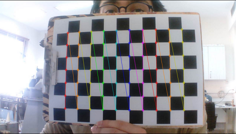
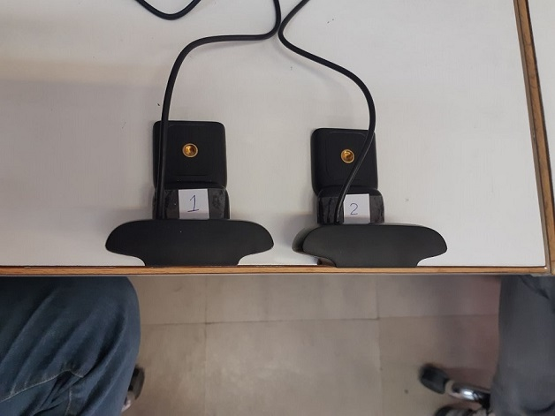

# Hand Gesture Recognition with Stereo Vision

This repository hold the code and components for my bachelor's degree project. It's hand tracking system that utilizes stereo vision to locate hands in 3d space. It uses Google's Mediapipe hand gesture recognition model for detecting the key points of hand in a video stream and the uses an orthonormal camera setup to locate hand in 3D space. 

## How to Run

Before running the code,  the cameras must be calibrated first. in order to calibrate the cameras and extract their intrinsic parameters, you need a checkered board. the details of calibration are explained in the next section. after calibrating run [main.py](src/main.py). 

## How to Calibrate the Cameras

In order to calibrate the cameras, you need a checkered board. Then ,using individual cameras, take pictures of the checkered board in different positions and store them in the images folder.
Then run [Calibration.py](src/Calibration.py) to extract the intrinsic parameters. you can also use [Calibration.ipynb](Jupyter/Calibration.ipynb) for a step by step analysis.

## Camera Setup

Since we assume an orthonormal camera setup, the cameras should be as level as possible. The baseline distance between cameras must also be updated in the code.